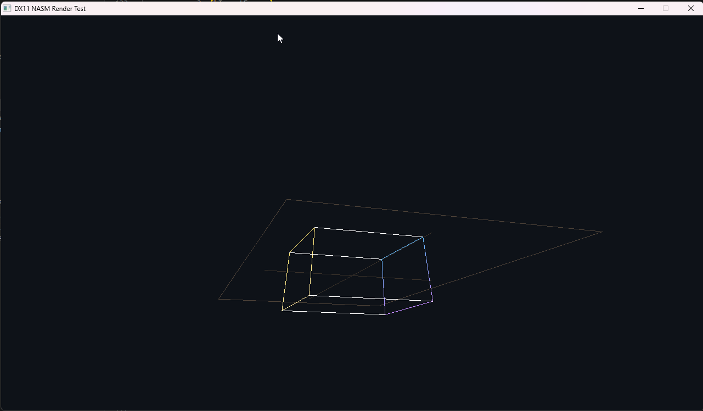

# Assembler Render DX11

A DirectX 11 project written in Assembly.

## Features
- Rendering and object drawing
- Shader support
- Test scene
- Basic physics
- Texture loading
- Window creation and graphics output

## About
This project was created to explore rendering, object drawing, shader usage, DirectX 11, textures, and basic physics in Assembly.

## Current Functionality
- DirectX 11 initialization
- Window creation
- Primitive rendering
- Shader pipeline
- Texture support
- Test scene
- Basic physics system

## Screenshot
